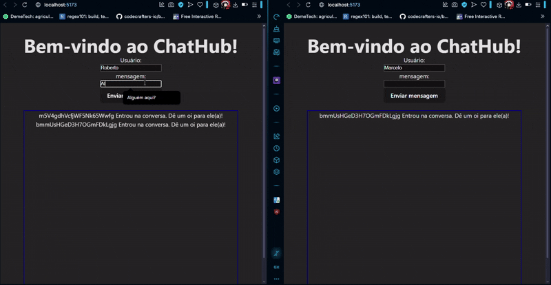

<h1>Chat em tempo Real</h1>

Este projeto consistem em uma aplicação web de um chat que é atualizado em tempo real

Foi utilizado SignalR tanto no backend, que foi desenvolvido usando Asp.Net, e no frontend, que foi desenvolvido com React

<h1>Objetivo</h1>

O principal objetivo foi aprender em como desenvolver uma aplicação em tempo real utilizando a tecnologia ASP.Net com SignalR

<h1>Tecnologias utilizadas</h1>
<ul>
	<li><b>HTML</b>: para definir uma raiz da página</li>
	<li><b>CSS</b>: para estilizar a página</li>
	<li><b>JS</b>: para conectar com o backend e receber e enviar as mensagens em tempo real</li>
	<li><b>React</b>: para renderizar e estrutuar a página através de componentes e estados</li>
	<li><b>ASP.Net</b>: para criar o servidor de mensagens no backend</li>
</ul>

<h1>Demonstração</h1>
